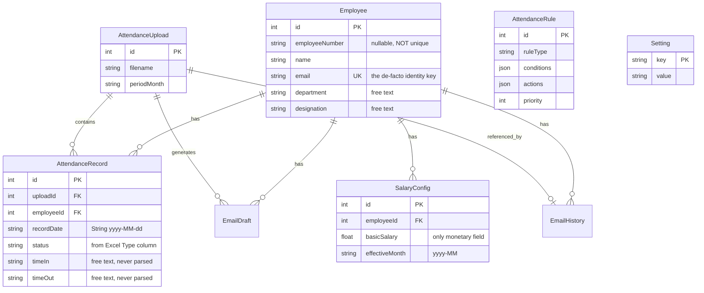

# HR Pulse — Audit for the Adamrit Accounting Integration

Read-only audit executed against the HR Pulse repo at commit `16f278d`. Adamrit was not
available in this session; everything needing it is collected in §9.

Every claim below cites `file:line`. Where something does not exist, it is marked
**NOT FOUND** rather than described as planned behaviour.

---

## 1. Executive summary

- HR Pulse today is an **attendance-notice emailer**, not a payroll system. It ingests a
  monthly Excel export, counts flagged days, computes a single LOP figure on request, and
  generates warning emails. Nothing is persisted as a payroll artifact.
- **None** of the structures the Adamrit integration assumes exist: no biometric/punch
  ingestion, no shift model, no role table, no payroll run, no payslip, no external-system
  ID column, and no outbound integration of any kind.
- The employee identity key is currently **email** (`attendance.ts:30`), not an employee
  number. `Employee.employeeNumber` is nullable, **not unique**, and is written only on
  first insert — never updated (`schema.prisma:12`, `attendance.ts:33`). When a row has no
  email, the importer **fabricates one** (`attendance.ts:27`), so identity can be a
  synthetic string.
- Attendance status is **read from the spreadsheet's "Type" column**, never computed
  (`excelParser.ts:150-151`, `STATUS_MAP` at `:53`). `timeIn`/`timeOut` are stored as
  free-form strings and are **never parsed or compared to a scheduled start time**. There is
  therefore no late-coming *calculation* in this codebase at all — only a late-coming label
  imported from elsewhere.
- Four defects would corrupt money if a voucher push were built on the current code as-is:
  duplicate attendance rows on re-upload (§5.1), the AWOL `consecutive` condition being
  silently ignored (§5.4), rule-declared LOP amounts never reaching the salary calculation
  (§5.5), and late/early days never affecting LOP despite the policy text saying they do.
- There is **no authentication on any route** (`index.ts:34-42`). This must be resolved
  before this service is trusted to post entries into a production accounting ledger.
- Recommendation on identity: **do not** use the Adamrit ledger ID as the HR Pulse primary
  key. Keep the internal autoincrement PK and add a unique, nullable `adamritLedgerId`
  mapping column. Reasoning in §4.3.

---

## 2. Inventory

| Item | Value | Source |
|---|---|---|
| Structure | npm workspaces monorepo: `shared`, `backend`, `frontend` | `package.json:4` |
| Backend | Express 4 + TypeScript | `backend/src/index.ts:1-18` |
| Frontend | React 18 + Vite + Tailwind | `frontend/package.json` |
| `shared` | Type declarations only, no runtime code | `shared/types/*.ts` |
| ORM | Prisma 5.22 | `backend/prisma/schema.prisma:1-3` |
| Database | PostgreSQL | `schema.prisma:5-8`, `url = env("DATABASE_URL")` |
| Migrations | Only two: `20260514181722_init`, `20260515014200_add_employee_photo` | `backend/prisma/migrations/` |
| Deploy | Railway + Nixpacks | `railway.toml` |
| Migration on deploy | `prisma migrate deploy` runs in `startCommand` | `railway.toml:6` |
| Health check | `GET /health` | `index.ts:51` |
| Startup seeding | `seedDatabase()` on every boot | `index.ts:29`, `db/seed.ts:288` |
| Config mechanism | `settings` key/value table, seeded from env | `db/seed.ts:3-15` |

**Route surface** (`index.ts:34-42`): `/api/attendance`, `/api/emails`, `/api/employees`,
`/api/salary`, `/api/settings`, `/api/sops`, `/api/rules`, `/api/ai`, `/api/analytics`.

**Authentication: NOT FOUND.** A grep across `backend/src`, `shared` and `frontend/src` for
`jsonwebtoken|passport|req.session|authenticate|authorization|api key|bearer` returns zero
matches. Every endpoint above is unauthenticated, including `PUT /api/salary/configs/bulk`
(`salary.ts:32`), which sets salaries.

**Outbound integrations:** only Ollama (`services/ollamaService.ts:35,59`, `routes/ai.ts:12`)
and SMTP (`services/emailService.ts`). **Adamrit / ledger / voucher / journal / external ID:
NOT FOUND** — zero matches anywhere in the repo, including migrations.

**Secrets handling note:** SMTP credentials are stored as plaintext rows in the `settings`
table (`db/seed.ts:7-8`). If Adamrit API credentials follow the same pattern they will be
plaintext in the database and readable through the unauthenticated `/api/settings` route.

---

## 3. Schema

Eleven models, single file `backend/prisma/schema.prisma`.

| Model | Table | Line | Notes |
|---|---|---|---|
| `Employee` | `employees` | :10 | PK `id` autoincrement; **`email` is the only unique** (:14); `employeeNumber` `String?` **not unique** (:12); `department`, `designation`, `organisation`, `entity` all nullable free-text strings (:16-19) |
| `AttendanceUpload` | `attendance_uploads` | :32 | One Excel import batch; `periodMonth` string `yyyy-MM` (:35) |
| `AttendanceRecord` | `attendance_records` | :47 | `recordDate` **String** `yyyy-MM-dd` (:51); `status` free string (:52); `timeIn`/`timeOut` `String?` (:53-54); **no unique constraint of any kind** |
| `EmailDraft` | `email_drafts` | :62 | `@@unique([uploadId, employeeId])` (:78) |
| `EmailHistory` | `email_history` | :82 | Sent-mail log |
| `SalaryConfig` | `salary_configs` | :98 | **`basicSalary` is the only monetary field** (:101); `@@unique([employeeId, effectiveMonth])` (:106) |
| `Setting` | `settings` | :110 | Key/value, PK is `key` |
| `EmailTemplate` | `email_templates` | :117 | `type` unique (:119) |
| `Sop` | `sops` | :126 | Policy documents |
| `AttendanceRule` | `attendance_rules` | :140 | `conditions` Json, `actions` Json, `priority`, `isActive` |
| `AiInsight` | `ai_insights` | :155 | LLM output cache |

### Presence check against the integration's requirements

| Required concept | Status |
|---|---|
| Employee master | **Present** — `Employee`, `schema.prisma:10` |
| Role / designation table | **NOT FOUND** — `designation` is a nullable string, `schema.prisma:19` |
| Biometric device / punch record | **NOT FOUND** — "punch" appears only as an Excel header alias, `excelParser.ts:46,49` |
| Attendance | **Present but import-shaped** — `AttendanceRecord`, `schema.prisma:47` |
| Shift definition | **NOT FOUND** |
| Shift assignment | **NOT FOUND** |
| Leave | **NOT FOUND** |
| Holiday | **NOT FOUND** as a table — only a status string value, `excelParser.ts:57` |
| Salary components | **NOT FOUND** — only `basicSalary`, `schema.prisma:101` |
| Payroll run | **NOT FOUND** |
| Payslip | **NOT FOUND** |
| External / ledger ID column | **NOT FOUND** |

### ER diagram (current state)



`Setting`, `EmailTemplate`, `Sop` and `AiInsight` have no foreign keys — `AiInsight.uploadId`
is an unconstrained nullable int (`schema.prisma:157`), not a declared relation.

---

## 4. Identity audit

### 4.1 Every person-identifier in the repo

| Identifier | Where generated | Type | Unique? | Nullable? | Stable? |
|---|---|---|---|---|---|
| `Employee.id` | Postgres autoincrement, `schema.prisma:11` | int | yes (PK) | no | yes |
| `Employee.email` | From the Excel `email` column, lowercased (`excelParser.ts:153`); **synthesised if absent** (`attendance.ts:27`) | string | **yes** (`schema.prisma:14`) | no | **no** — changes if the person's email changes |
| `Employee.employeeNumber` | Excel `employee number` column (`excelParser.ts:156`), written **only on create** (`attendance.ts:33`) | string | **no** | **yes** | not enforced |
| Excel header aliases | `HEADER_MAP`, `excelParser.ts:23-50` | — | — | — | — |
| Adamrit ledger ID | — | — | — | — | **NOT FOUND — does not exist here** |

### 4.2 The current join path

`AttendanceRecord.employeeId` → `Employee.id` (`schema.prisma:57`). Rows are attached to a
person by the upsert at `attendance.ts:30-34`, which keys on **`email`**, not on
`employeeNumber`.

Three consequences worth stating plainly:

1. `employeeNumber` appears in the `create` branch only (`attendance.ts:33`). If the biometric
   export's ID changes for an existing employee — exactly what this project intends to do —
   the `update` branch (`attendance.ts:32`) will **silently not update it**. Existing rows keep
   the old number forever.
2. If the sheet has no email, `attendance.ts:27` builds
   `unknown_<name>@hrpulse.local`. Identity then depends on the spelling of a name. Two
   spellings create two employees; two different people sharing a name merge into one.
3. **No path to any external accounting system exists.** Confirmed by grep in §2.

### 4.3 Assessment: "make the biometric employee ID equal to the Adamrit ledger ID"

**Which column would hold it?** `employeeNumber` (`schema.prisma:12`) is the only candidate.
It is nullable and non-unique today, so it would need a unique constraint plus a backfill
before it could carry a ledger ID.

**What would break:**

| Scenario | Consequence today |
|---|---|
| Existing attendance history | Records are bound to `Employee.id`, so history survives an `employeeNumber` change — *provided* the upsert is fixed to key on it (see 4.2 #1). |
| Ledger ID changes in Adamrit | If it were the PK, every FK in five tables cascades. Confirmed cascade rules at `schema.prisma:56-57`, `75-76`, `92-93`, `104`. |
| Re-hire (same person, new ledger) | Unique-on-ledger-ID plus unique-on-email conflict: the person cannot be re-created, and reusing the old row silently merges two employment periods. |
| Employee onboarded before a ledger exists | A non-null unique PK cannot be deferred. The row cannot be created at all. |
| Employee with no ledger (contractor, intern) | Same — blocked entirely. |
| Excel/biometric sheet still carrying the old device ID during transition | Rows import under the old number and, per 4.2 #1, are never corrected. |

**Recommendation — option 2, the mapping column.**

Keep `Employee.id` as the internal PK and add:

```
adamritLedgerId  String?  @unique @map("adamrit_ledger_id")
adamritLinkedAt  DateTime? @map("adamrit_linked_at")
```

Rationale, grounded in what is above rather than in general principle:

- The PK is already referenced by four cascading relations (`schema.prisma:56-57, 75-76,
  92-93, 104`). Making it an externally-owned value hands cascade-delete authority over HR
  Pulse history to a different system's accounting module.
- Nullability is required, and a PK cannot be null. Employees demonstrably exist here before
  any ledger does — the importer creates them from a spreadsheet row (`attendance.ts:30`).
- A unique nullable column gives a first-class "not yet linked" state, which is exactly what
  is needed to block a payroll push for an unlinked employee rather than to fail at import.
- Option 1 buys nothing that option 2 does not, because the biometric device stores the
  ledger ID either way. The device ID lands in `employeeNumber`; what matters is that
  `employeeNumber` and `adamritLedgerId` are then the same value and both unique.

**Needs a human decision** (carried to §10): whether `employeeNumber` and `adamritLedgerId`
should be one column or two. Two is safer during transition — the device ID and the ledger ID
can disagree while the migration is in flight, and the disagreement is then queryable rather
than invisible.

---

## 5. Calculation trace — what actually happens today

```
Excel file
  → POST /api/attendance/upload            attendance.ts:14
  → parseAttendanceExcel()                 excelParser.ts:102
  → Employee.upsert (keyed on email)       attendance.ts:30
  → AttendanceRecord.create                attendance.ts:36
  → GET /api/attendance/summary/:uploadId  attendance.ts:54   (counts, on request)
  → POST /api/rules/evaluate/:uploadId     rules.ts:49
  → evaluateRulesForUpload()               ruleEngine.ts:73
  → EmailDraft.upsert                      rules.ts:175
```

| Stage | Status |
|---|---|
| Punch-time ingestion from a device | **Absent** |
| Daily attendance record | **Present** — `attendance.ts:36` |
| Status derivation | **Absent as computation** — imported, see 5.2 |
| Late-coming calculation | **Absent** — see 5.3 |
| Grace period / half-day / overtime | **Absent** — see 5.3 |
| Rule evaluation | **Present, partial** — see 5.4 |
| Deduction calculation | **Present, minimal** — see 5.5 |
| Persisted payroll artifact | **Absent** — see 5.6 |
| Push to accounting | **Absent** |

### 5.1 Ingestion — duplicate rows on re-upload

`attendance.ts:36` calls `prisma.attendanceRecord.create`, not `upsert`, and
`AttendanceRecord` has **no unique constraint** (`schema.prisma:47-60`). Uploading the same
month twice produces two rows per employee per day.

Every downstream count is a `filter(...).length` over those rows — `attendance.ts:71-76`,
`salary.ts:59-60`, `rules.ts:79-84`. So a double upload **doubles** absent days, which doubles
`lopAmount` via `lopService.ts:8-10`. Today that only inflates an email. Once this figure
becomes a voucher amount, it becomes a wrong debit in a production ledger.

**This must be fixed before any posting integration is built.** The fix is a
`@@unique([uploadId, employeeId, recordDate])` plus an upsert — but note that a unique on
`uploadId` still allows two *different* uploads of the same month to coexist, and the summary
endpoints are scoped per `uploadId`, so a period-level uniqueness rule is the real
requirement.

### 5.2 Status is imported, not computed

`excelParser.ts:150-151` reads the sheet's `type` column and passes it through `normalizeStatus`
(`:97`), which maps against `STATUS_MAP` (`:53-67`). `'Late Coming'`, `'Absent'`,
`'Missed Swipe'` and `'Early Leaving'` are therefore **decisions made by the upstream
SmartTime system**, not by HR Pulse. An unrecognised value passes through verbatim
(`:99`), so a spelling change upstream silently produces a status that no counter matches
and no rule fires on.

### 5.3 There is no late-coming logic

- `timeIn`/`timeOut` are stored as raw trimmed strings (`excelParser.ts:163-164`,
  `schema.prisma:53-54`). Nothing parses them. Nothing compares them to a start time.
- `GET /api/attendance/records/:uploadId/:employeeId` returns them for display
  (`attendance.ts:98`); that is their only use.
- The 15-minute grace period exists **only as prose**, in an SOP document
  (`db/seed.ts:111`), in a rule description (`:201`), and as a `gracePeriodMinutes: 15` key in
  one rule's `actions` JSON (`:204`). That key is **not in the `RuleActions` interface**
  (`ruleEngine.ts:25-38`) and is never read anywhere. It is dead configuration.
- No scheduled start time exists in the schema to compare against, which is the root reason.

### 5.4 Rule engine — `consecutive` is silently ignored

`evaluateRulesForUpload` (`ruleEngine.ts:73`) loads active rules by `priority` and matches
each employee summary against `conditions`. `evaluateRule` (`:46-54`) checks exactly six
numeric fields.

`RuleConditions` declares `consecutive?: boolean` (`ruleEngine.ts:22`), and the AWOL rule sets
`consecutive: true` (`db/seed.ts:192`) — but `evaluateRule` **never reads it**. The AWOL rule's
effective condition is therefore `absentDays >= 3`, identical to the "Repeated Absence"
rule at `db/seed.ts:174`. Any employee with 3 non-consecutive absences is currently flagged
AWOL, notified to the HR Director, and marked for investigation (`db/seed.ts:193`).

Also note `ruleEngine.ts:82`: employees with `flaggedTotal === 0` are skipped entirely, so a
clean employee can never match a rule — fine today, but it means the engine cannot express a
positive/compliance rule later.

### 5.5 Deduction — rule-declared LOP never reaches the money

`calculateLOP` (`lopService.ts:1-12`) is the entire salary calculation:

```
effectiveDays = absentDays + missedSwipeDays × missedSwipeWeight
lopAmount     = round(basicSalary / workingDays × effectiveDays)
```

Called from `attendance.ts:79`, `salary.ts:62` and `rules.ts:88`.

Two gaps with financial consequence:

1. **Late coming and early leaving do not affect pay.** They are counted
   (`attendance.ts:74-75`) and they drive email severity, but they are not arguments to
   `calculateLOP` (`lopService.ts:1-6`). The seeded policy says 4–6 lates = 0.5 day LOP and
   7+ = 1 day (`db/seed.ts:213,222`); the code does not implement it.
2. **`lopMultiplier` and `lopDays` in rule actions are inert.** They are declared in
   `RuleActions` (`ruleEngine.ts:32-33`) and set on eight seeded rules (`db/seed.ts:166, 175,
   213, 222, 233, 242, 253, 262`), but no code path passes them to `calculateLOP`. The rule
   engine's output is used only to select an email template and set flags (`rules.ts:119-137`).

So the rules that appear to configure deductions currently configure only the wording of an
email. If a voucher were generated from `lopAmount` today, it would not match the policy the
emails cite.

`workingDays` is a single global setting defaulting to `'26'` (`db/seed.ts:13`, read at
`attendance.ts:57`, `salary.ts:47`, `rules.ts:61`) — not per role, per shift, or per month.

### 5.6 No persisted payroll artifact

`GET /api/salary/deductions/:uploadId` (`salary.ts:44-67`) computes and returns; it writes
nothing. Re-running it after an attendance correction returns a different number with no
record that it changed.

There is no payroll-run row, no period lock, no approval state, and therefore **no stable
identifier that could serve as an idempotency key** for a voucher push. This is the single
largest structural gap for the integration.

---

## 6. Gap list — role-based shift rules

Target: nurses `08:00–14:00`, `14:00–20:00`, `08:00–20:00`; general staff `09:00–18:00`;
doctors/RMOs later.

1. **Role is not modelled.** `Employee.designation` is a nullable free-text string
   (`schema.prisma:19`), settable to anything via `PATCH /api/employees/:id`
   (`employees.ts:29-36`) with no validation and no enum. "Nurse", "nurse", "Staff Nurse" and
   `null` are four distinct values. A shift cannot be keyed off it reliably. A `Role` table
   with an FK from `Employee` is required, plus a backfill and a mapping of the existing
   free-text values — and note the `shared/types/employee.ts:1-9` interface does not even
   expose `designation`, so the frontend contract needs updating too.
2. **No shift definition table.** Nothing in the schema comes close. Needs at minimum:
   name, start time, end time, a `crossesMidnight` flag, expected hours, grace minutes,
   half-day threshold.
3. **No shift assignment.** Nurses rotate between three shifts, so assignment must be
   **per employee per date** (or per date range), not a single column on `Employee`. A
   role-level default plus per-date overrides is the minimum workable shape.
4. **The 12-hour shift and midnight-crossing are unrepresentable.**
   `AttendanceRecord.recordDate` is a **String** `yyyy-MM-dd` (`schema.prisma:51`) with no
   time and no timezone, and `timeIn`/`timeOut` are unparsed strings (`:53-54`). A shift
   ending at 20:00 fits inside one calendar date, so `08:00–20:00` is representable *if*
   times are parsed — but any future night shift crossing midnight is not, because a single
   attendance row cannot span two dates. Deciding now that a shift instance is anchored to
   its **start** date avoids a painful migration later.
5. **Minimum data for computed late-coming.** To compute rather than import, each day needs:
   the resolved shift for that employee on that date, an actual first-in timestamp, an actual
   last-out timestamp, and the grace/half-day thresholds for that shift. Of these, HR Pulse
   currently stores **none** in a usable type.
6. **`working_days` must become shift-aware.** A nurse on 12-hour shifts does not work the
   same number of days as a 09:00–18:00 employee, but `lopService.ts:9` divides by one global
   number (`db/seed.ts:13`). Per-role or per-shift working days are required before LOP can be
   correct for nurses.
7. **Doctors/RMOs plug-in point.** If shifts are resolved via `Role → ShiftPattern →
   ShiftAssignment`, adding RMOs later is adding rows, not schema. Keeping any nurse-specific
   logic out of code and in data is what preserves that.

---

## 7. Gap list — payroll and voucher posting

1. **Salary inputs are one field.** `SalaryConfig.basicSalary` (`schema.prisma:101`). No gross,
   no allowances (housing, transport), no employer contributions, no statutory deductions, no
   net pay. A voucher needs a full earnings/deductions breakdown, not a single LOP number.
2. **No payroll run.** Nothing represents "payroll for 2026-07, calculated, approved, posted".
   Without it there is no state machine and nothing to lock.
3. **No idempotency key candidate.** Per §5.6, deductions are computed on request. A retry
   would recompute — possibly to a different value if attendance changed in between — and
   post again. The key must derive from a persisted, immutable payroll-run row.
4. **No posting status.** No field records whether a voucher was created in Adamrit, its
   voucher number, or when. Reconciliation would be impossible.
5. **Currency and rounding are undefined.** `basicSalary` is a `Float`
   (`schema.prisma:101`) — a binary floating-point type — and `lopAmount` is
   `Math.round(...)` to whole units (`lopService.ts:10`). Accounting systems generally use
   fixed-precision decimals. Float for money should be changed to `Decimal` before amounts
   cross into a ledger; the rounding rule must then be agreed with Adamrit rather than
   assumed.
6. **What a voucher push needs from HR Pulse, none of which exists yet:** the Adamrit ledger
   reference, the payroll period, a per-employee amount with its breakdown, a narration, and a
   stable idempotency key.
7. **No authentication (§2).** An unauthenticated service must not hold credentials that post
   to a production ledger.

---

## 8. Reuse opportunities

Extend these rather than building parallel machinery:

| Existing | Path | Verdict |
|---|---|---|
| `AttendanceRule` + `ruleEngine.ts` | `schema.prisma:140`, `services/ruleEngine.ts:73` | **Extend.** The Json `conditions`/`actions` shape already supports adding shift-aware conditions without a migration. Fix `consecutive` (§5.4) and wire `lopDays`/`lopMultiplier` into the calculation (§5.5) as part of the same work — the plumbing is declared, only the wiring is missing. |
| `Setting` key/value table | `schema.prisma:110`, `db/seed.ts:290` | **Extend for globals only.** Correct for an Adamrit base URL or a global default. **Wrong for per-shift thresholds** — those are structured, per-row data and belong in a shift table, not stringly-typed keys. Also unsuitable for API credentials while `/api/settings` is unauthenticated. |
| `services/` + `routes/` layering | `services/lopService.ts`, `routes/salary.ts` | **Follow it.** An `adamritClient.ts` service plus a thin route matches the existing convention exactly. |
| `calculateLOP` | `services/lopService.ts:1` | **Extend, do not replace.** Signature must grow to accept late/early days and rule-derived LOP days; the three call sites are `attendance.ts:79`, `salary.ts:62`, `rules.ts:88`. |
| `getSettings()` helper | Duplicated at `attendance.ts:9` and `salary.ts:7` | Minor: already duplicated twice; a third copy for the Adamrit client should instead be lifted into a shared helper. |
| `AttendanceUpload` | `schema.prisma:32` | **Do not overload it as a payroll run.** It is an import batch — several can exist for one month, and it has no approval state. Payroll runs need their own table. |

---

## 9. Information needed from Adamrit

To be answered by running Prompt B in a session that has that repo
(`docs/ADAMRIT_INTEGRATION_PROMPT.md`):

1. The employee salary ledger's identifier: exact type, generation, length and character
   constraints. This decides whether it can live in a biometric device's ID field, and
   whether `adamritLedgerId` should be `String` or `Int`.
2. Whether that identifier is immutable after creation, and what happens on ledger
   deactivation or deletion.
3. How a ledger is currently associated with a staff member — real FK, name match, or nothing.
4. The exact required input for creating a voucher / journal voucher, including whether
   entries must balance and how voucher numbers are allocated.
5. Whether Adamrit has any existing idempotency or duplicate-submission guard.
6. Accounting period / financial-year locking: what happens when posting into a closed period,
   and whether a posted voucher can be reversed.
7. Whether an authenticated API surface exists for external callers, and its auth mechanism.
8. The expected currency and rounding convention for posted amounts (§7.5).

---

## 10. Open questions for you, with recommended defaults

| # | Question | Recommended default |
|---|---|---|
| 1 | One column or two for the device ID and the ledger ID? | **Two** — keep `employeeNumber` as the device/biometric ID and add a separate unique `adamritLedgerId`. They can be set to the same value, but a disagreement during transition stays visible instead of silently overwriting. |
| 2 | Does the biometric feed replace the Excel upload, or run alongside it? | **Alongside, during transition.** The Excel path is the only working ingestion (`attendance.ts:14`); removing it before punch ingestion is proven leaves no data source. |
| 3 | Will raw in/out punch **times** be available from the device? | **Assume yes and require it.** Without timestamps, late-coming remains imported rather than computed (§5.3) and the whole shift-rule feature is unimplementable. If the answer is no, say so early — it changes the entire design. |
| 4 | Grace period, half-day and overtime thresholds **per shift**? | Default the 15 minutes already written in policy (`db/seed.ts:111`) for the 09:00–18:00 general shift; the three nurse shifts need explicit values from you — do not assume they inherit. Overtime: assume **not paid** until you say otherwise. |
| 5 | One consolidated journal voucher per period, or one per employee? | **One consolidated JV per payroll period**, with per-employee lines. Fewer postings, one idempotency key per run, and it matches how salary is normally journalised — but confirm against Adamrit's voucher-line model (§9.4). |
| 6 | Employee with no Adamrit ledger at payroll time? | **Block the run and list them.** Skipping silently under-pays someone; a suspense ledger hides the error in accounting. Blocking surfaces it while it is still cheap to fix. |
| 7 | Fix the duplicate-attendance defect (§5.1) before or during the integration? | **Before, and independently.** It is a live data-correctness bug today and a wrong-debit bug the moment amounts are posted. |
| 8 | Change `basicSalary` from `Float` to `Decimal`? | **Yes, before any posting.** Cheap now, and a migration on live payroll data later is not. |

---

*Discovery only. No code, schema or data was modified in producing this report.*
